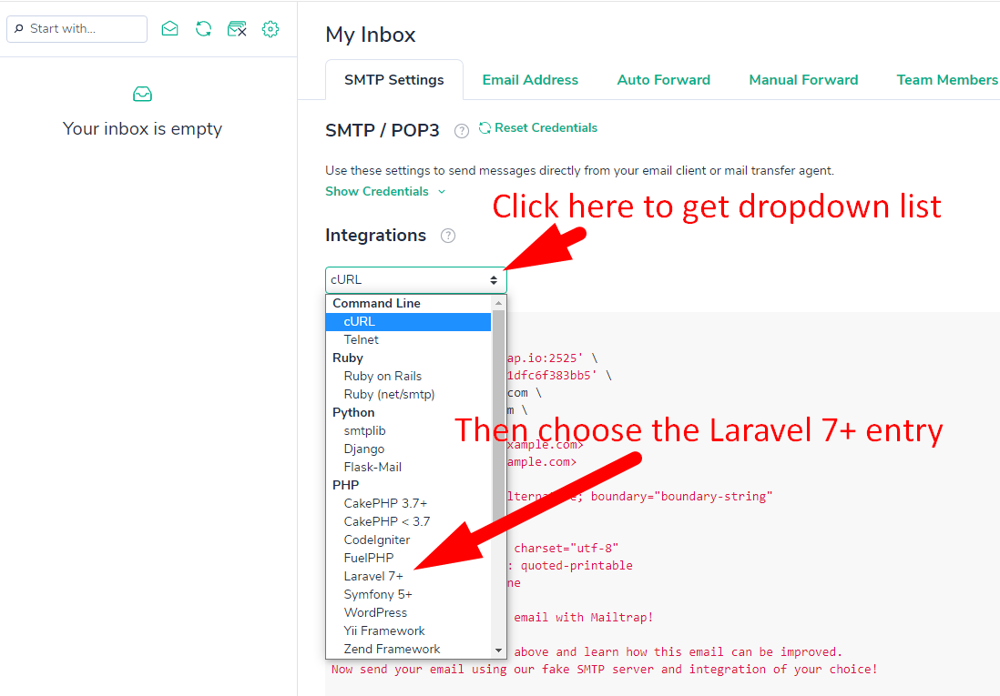
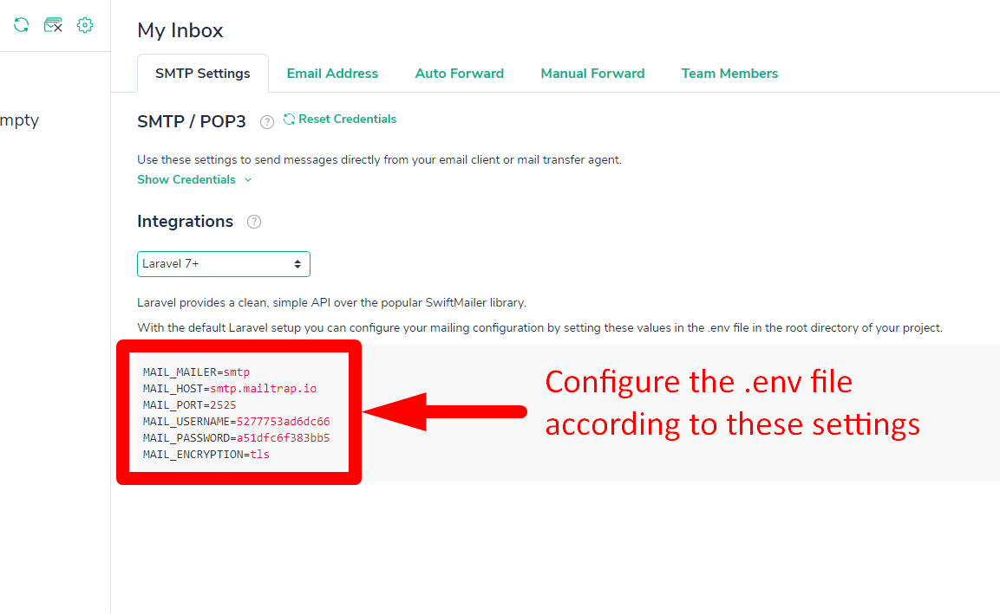

We present You the foundation for your online application, in which the admin panel is already configured. 
 Already implemented:
  - authentication
  - validation of mail
  - password reset
  - CRUD of users
  - CRUD of roles
  - User and Role SEEDS

Getting Started:

1. "Place the parent directory on a web server or local server"
2. Run 
    ###### composer install
3. Copy the "env.example" file in the root directory and rename it to ".env"
4. Create database
5. In .env file update the database configuration variables 
6. Generate APP_KEY - php artisan key: generate
7. Run migration and seed 
    ######php artisan migrate --seed
8. To get back access to registration form remove **showRegistrationForm()** overriding method in **RegisterController.php**

9. For email verification to work correctly you will need to update your email variables in .env file. If you want to test email verification You can use a free mail server [mailtrap.io](https://mailtrap.io/)

###then

Enjoy your use!
